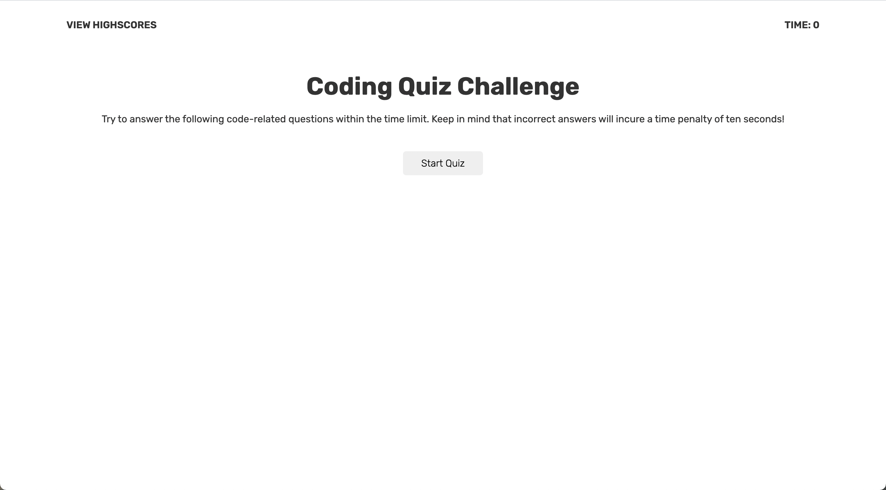
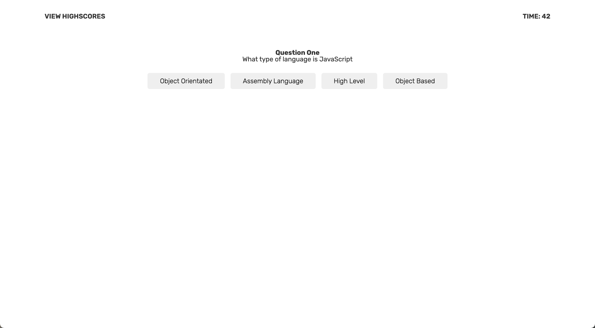
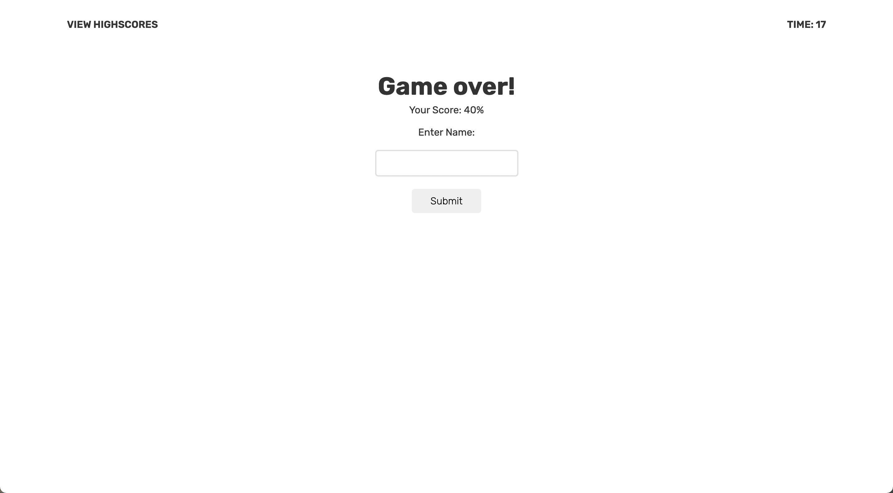
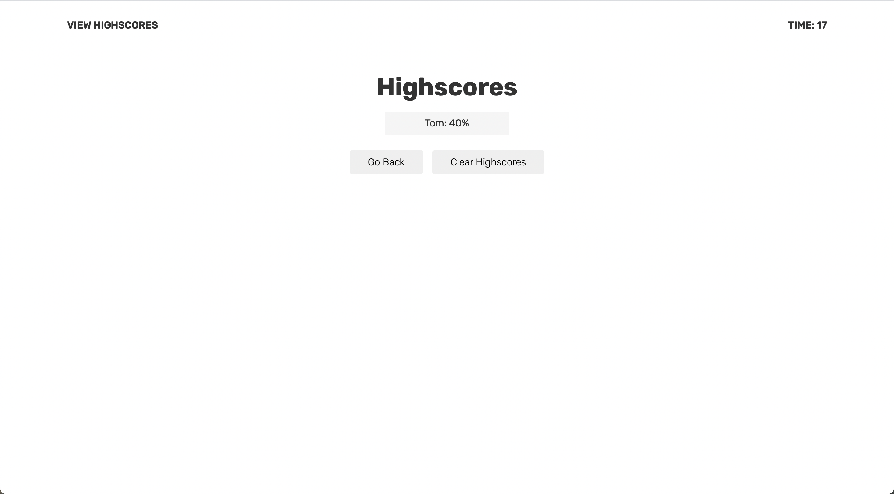

# JavaScript Coding Quiz

## How does it work?

This is a game to test your knowledge on JavaScript! It is a multiple choice quiz, calculating your percentage at the end of the game. You can keep track of a scoreboard locally.

## Why do this?

This website is dedicated to making learning more fun. With the included countdown timer, you can challenge yourself to see how much your really know about the programming language.

## Deployment

The online quiz game has been deployed at:
[Coding Quiz](https://punkinut.github.io/coding-quiz/)

## Starting Page

## Question Example

## Game Over Page

## Scoreboard

## Final Notes
I hope you enjoyed playing along and happy coding :)

